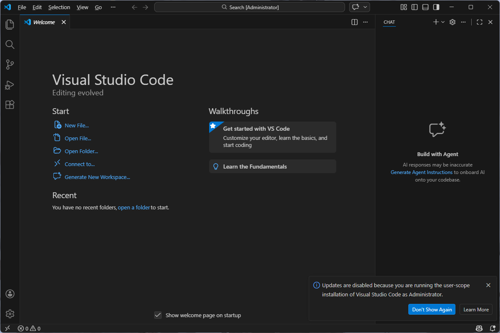
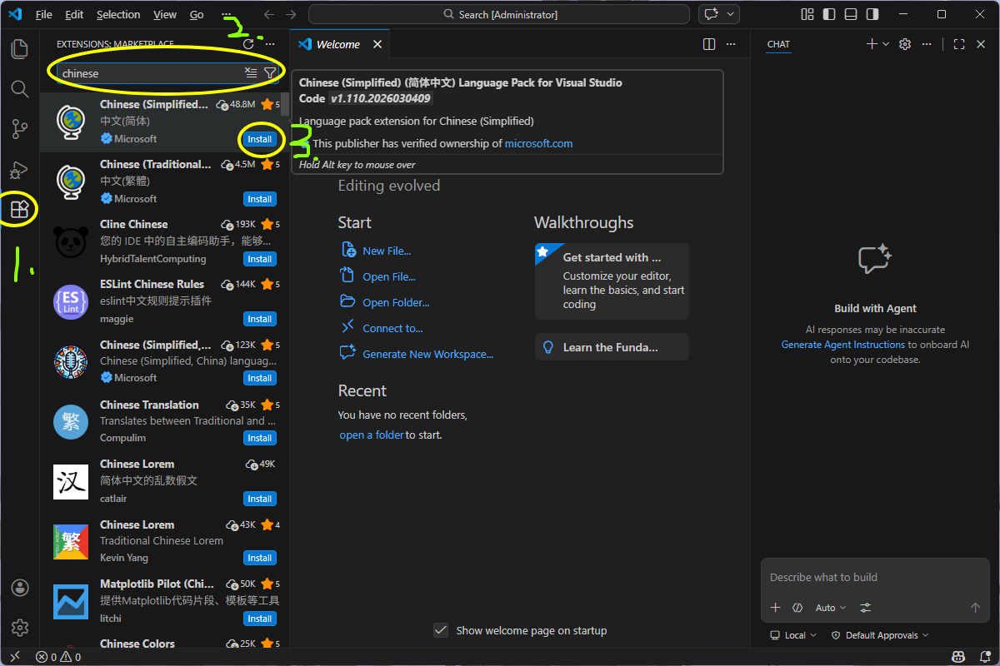
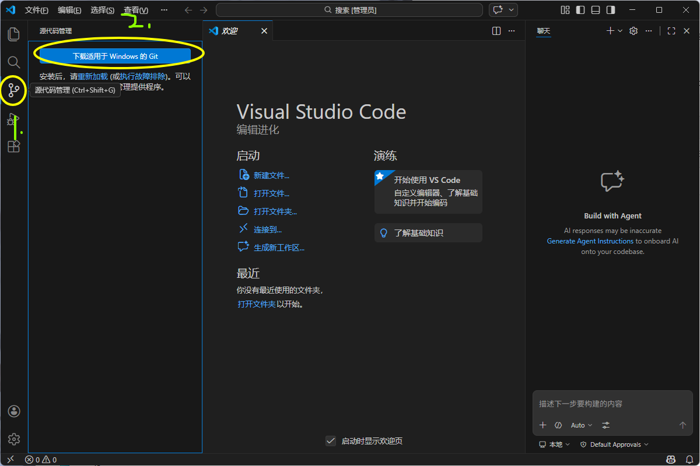
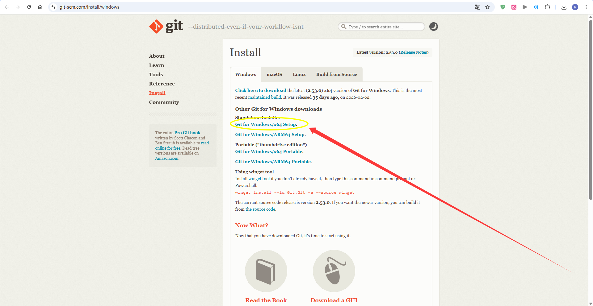
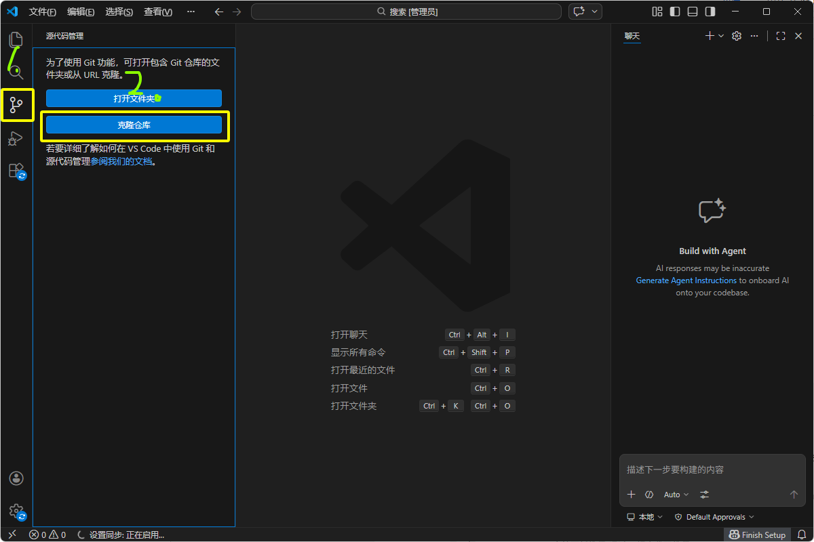
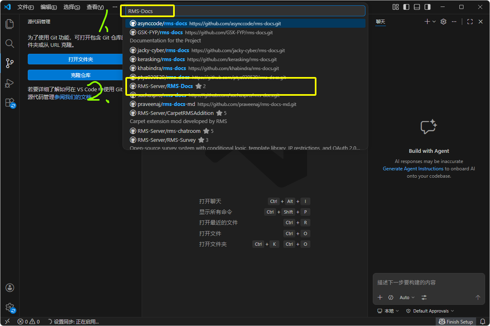
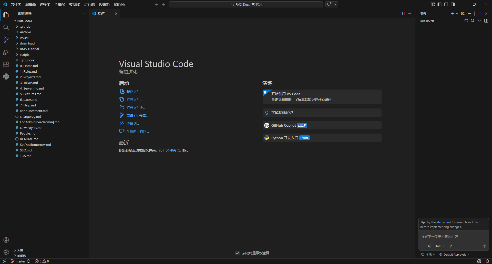

# Docs Tutorial: Setup

本教程用于指导如何准备本地环境，并将 `RMS-Docs` 文档仓库拷贝到本地，供后续修改和提交流程使用。

## 1. 下载并安装 VS Code

### 操作步骤

1. 打开 VS Code 官网：[https://code.visualstudio.com/](https://code.visualstudio.com/)
2. 点击首页的下载按钮。
3. 根据自己的操作系统选择安装包版本。
4. 下载完成后，双击安装程序。
5. 按安装向导完成安装。
6. 安装完成后，启动 VS Code。

图 1：第一次打开 VS Code 时的界面。

### 说明

- Windows 用户通常选择默认安装即可。
- 如果安装过程中出现“添加到 PATH”或“添加到右键菜单”等选项，建议勾选，后续使用会更方便。

---

## 2. 安装中文插件

为了便于后续操作，可以先安装中文语言插件。

### 操作步骤

1. 打开 VS Code。
2. 点击左侧扩展图标。
3. 在搜索框中输入 `Chinese`。
4. 找到中文语言包插件并点击安装。
5. 安装完成后，按界面提示重启 VS Code。

图 2：安装中文插件后，按指引重启 VS Code 即可。

### 说明

- 常用插件名称通常为 `Chinese (Simplified) Language Pack for Visual Studio Code`。
- 重启后，界面会切换为中文，更方便后续按教程操作。

---

## 3. 下载并安装 Git

在使用 VS Code 进行 Git 操作前，还需要先安装 Git。

### 操作步骤

1. 打开 Git 官网下载页面或其他可用下载页面。
2. 根据自己的系统选择对应版本下载安装包。
3. 下载完成后，双击安装程序。
4. 安装过程中保持默认选项即可。
5. 安装完成后，重启 VS Code。

图 3：Git 下载途径示意图。

图 4：Git 安装界面示意图，安装时保持默认配置即可。

### 说明

- 如果没有特殊需求，Git 安装过程全程保持默认配置即可。
- 安装完成后建议重启 VS Code，确保 Git 能被编辑器正常识别。

---

## 4. 在 VS Code 中登录 GitHub

完成 Git 安装后，建议先在 VS Code 中登录 GitHub，后续推送分支和创建 PR 会更方便。

### 操作步骤

1. 打开 VS Code。
2. 按图中步骤依次点击登录入口。
3. 按图中提示，在上方选择 `GitHub 源`。
4. VS Code 会自动跳转到浏览器。
5. 按浏览器页面提示完成授权和登录。
6. 登录成功后，返回 VS Code 继续操作。

图 5：按步骤点击后，在上方选择 GitHub 源。

### 说明

- 选择 GitHub 源后，通常会自动打开默认浏览器。
- 只需要按页面指引完成登录和授权即可。
- 登录成功后，后续 `Push`、`Publish Branch`、创建 PR 等操作会更顺畅。

---

## 5. 将服务器文档拷贝到本地

完成 GitHub 登录后，可以按以下步骤把服务器文档拷贝到本地。

### 操作步骤

1. 按图 6 所示步骤进入仓库搜索或克隆入口。
2. 以 `RMS-Docs` 为关键词进行搜索。
3. 在搜索结果中，必须选择 `RMS-Server/RMS-Docs`。
4. 按引导选择文件存放的本地路径。
5. 如果出现弹窗，保持默认选项即可。
6. 等待操作完成。

图 6：以 `RMS-Docs` 为关键词搜索，并选择 `RMS-Server/RMS-Docs`。

图 7：服务器文档已经成功拷贝到本地。

### 说明

- 搜索时不要选错仓库，必须选择图中圈出的 `RMS-Server/RMS-Docs`。
- 选择本地存放路径时，按自己的习惯选择一个方便后续查找的位置即可。
- 如果中途出现确认弹窗，直接保持默认选项继续即可。

---

上一篇：[0. General.md](./0.%20General.md)

下一篇：[2. Edit Docs.md](./2.%20Edit%20Docs.md)

