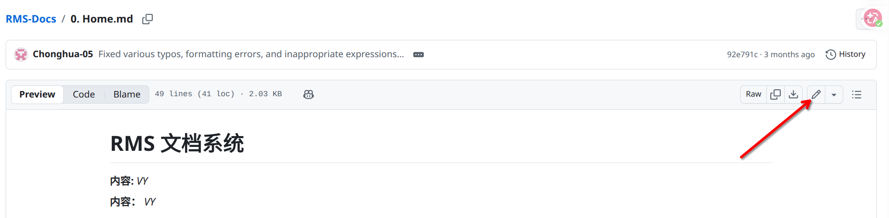
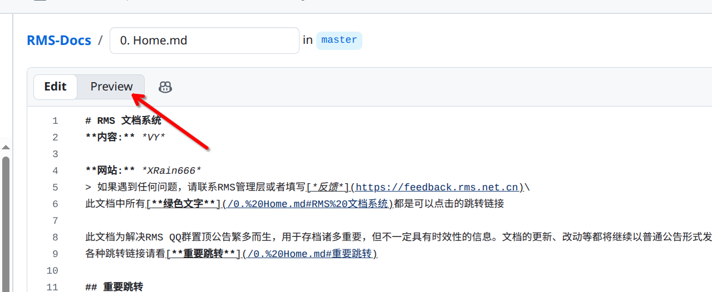

# Docs Tutorial: Edit Docs

完成 Fork 后，就可以开始修改文档了。本篇介绍如何在 GitHub 网页上编辑文档。

## 1. 找到要修改的文件

### 操作步骤

1. 打开你自己 Fork 的仓库页面：`https://github.com/你的用户名/RMS-Docs`
2. 浏览文件夹，找到你想要修改的文件。
3. 点击文件名打开文件。

### 说明

- 文档都在仓库的各个文件夹中，可以根据需要修改的内容找到对应文件。
- 记住是访问你自己 Fork 的仓库，不是原仓库 `RMS-Server/RMS-Docs`。

---

## 2. 进入编辑模式

### 操作步骤

1. 在文件内容上方，找到铅笔图标（Edit this file）。



图 1：点击铅笔图标进入编辑模式。

2. 点击后，页面会进入编辑模式，你可以直接修改文件内容。

### 说明

- 进入编辑模式后，GitHub 会自动为你创建一个新分支，修改都在这个分支上进行。
- 不需要手动创建分支，GitHub 会自动处理。

---

## 3. 认识 Markdown 基础语法

在 `RMS-Docs` 中，大部分内容都使用 Markdown 编写。修改文档前，让我们先了解最常用的基础语法。

### 常用语法示例

```markdown
# 一级标题
## 二级标题
### 三级标题

普通正文

- 无序列表
- 第二项

1. 有序列表
2. 第二项

[链接文字](https://example.com)


**加粗文字**
`行内代码`
```

### 说明

- `#` 用来表示标题，`#` 越多，标题级别越低。
- `-` 可以表示无序列表。
- 数字加英文句号可以表示有序列表。
- 图片和链接都需要使用英文括号。
- 修改文档时，尽量保持原有格式风格一致。

---

## 4. Markdown 表格语法

很多文档信息适合用表格展示，例如清单、状态、说明对比等。Markdown 表格的基本写法如下：

```markdown
| 列 1 | 列 2 | 列 3 |
| --- | --- | --- |
| 内容 A | 内容 B | 内容 C |
| 内容 D | 内容 E | 内容 F |
```

显示效果如下：

| 列 1 | 列 2 | 列 3 |
| --- | --- | --- |
| 内容 A | 内容 B | 内容 C |
| 内容 D | 内容 E | 内容 F |

### 说明

- 第一行是表头。
- 第二行是分隔线，至少要有 `---`。
- 从第三行开始才是表格内容。
- 每一列之间用英文竖线 `|` 分隔。
- 建议始终使用英文符号，不要混用中文标点。

---

## 5. 表格中最常见的修改方式

日常修改文档时，最常见的表格操作有以下几种。

### 1. 修改单元格内容

直接找到对应单元格，把原来的文字替换掉即可。

```markdown
| 名称 | 状态 |
| --- | --- |
| 文档 A | 已完成 |
```

### 2. 新增一行

在表格最后复制一整行，再把内容改成新的数据。

```markdown
| 名称 | 状态 |
| --- | --- |
| 文档 A | 已完成 |
| 文档 B | 进行中 |
```

### 3. 删除一行

直接删掉对应那一整行即可，但不要删到表头和分隔线。

### 4. 新增一列

表头、分隔线、每一行数据都要同步增加一列，例如：

```markdown
| 名称 | 状态 | 备注 |
| --- | --- | --- |
| 文档 A | 已完成 | 已检查 |
| 文档 B | 进行中 | 待补图 |
```

### 5. 删除一列

删除时要保证每一行都删掉同一列，否则表格会错位。

---

## 6. 预览修改效果

### 操作步骤

1. 在编辑区域上方，点击 `Preview` 标签。
2. 查看修改后的渲染效果。
3. 确认无误后，点击 `Edit` 标签返回编辑模式继续修改。



图 2：点击 Preview 可以预览修改效果。

### 说明

- 预览可以帮助你确认格式是否正确。
- 如果表格没有正确显示，通常是分隔线或列数有问题。

---

## 7. 常见表格问题

### 1. 表格没有正常显示

常见原因：

- 漏掉了第二行分隔线
- 某一行少写了一个 `|`
- 某一行的列数和其他行不一致

### 2. 表格内容错位

通常是因为新增或删除列时，没有同步修改每一行。

### 3. 表格太宽，不方便阅读

如果一张表格里文字太多，可以考虑：

- 简化列名
- 把长段文字改成简短说明
- 改成列表或分段说明，而不是强行保留表格

---

## 8. 借助网页 AI 辅助整理内容

如果你不确定文案怎么写，或者想把零散内容整理成更规范的说明或表格，可以借助网页 AI 帮忙。但 AI 生成的内容必须人工检查后再使用。

### 推荐用法

1. 先整理好你已有的原始内容。
2. 把原文粘贴到网页 AI 中。
3. 明确告诉 AI 你的目标，例如润色说明、整理步骤，或者输出成 Markdown 表格。
4. 检查 AI 返回的列名、行数、路径、按钮名称和内容是否准确。
5. 确认无误后，再粘贴回 GitHub 编辑器中。

### 示例提示词

```text
请把下面这些内容整理成适合文档使用的 Markdown 内容，保留原意，语言简洁，格式清晰：
```

```text
请把下面这些内容整理成 Markdown 表格，保留原意，列名清晰，适合放进文档中：
```

### 适合让 AI 帮忙的场景

- 把一段散乱说明整理成列表或步骤
- 把零散信息整理成表格
- 统一多行内容的表达格式
- 帮你补齐更规范的列名

### 不适合直接照搬的场景

- 涉及准确路径、仓库名、文件名、版本号
- 涉及按钮名称或页面文案
- 你自己都还没确认真实性的信息

### 说明

- AI 可以帮助整理格式，但不能替你确认事实。
- 表格内容最终仍然需要你自己核对。
- 粘贴回文档前，最好再检查一次格式、表格对齐和内容准确性。

---

上一篇：[1. Setup.md](/Docs%20Tutorial/1.%20Setup.md)

下一篇：[3. Submit PR.md](/Docs%20Tutorial/3.%20Submit%20PR.md)
