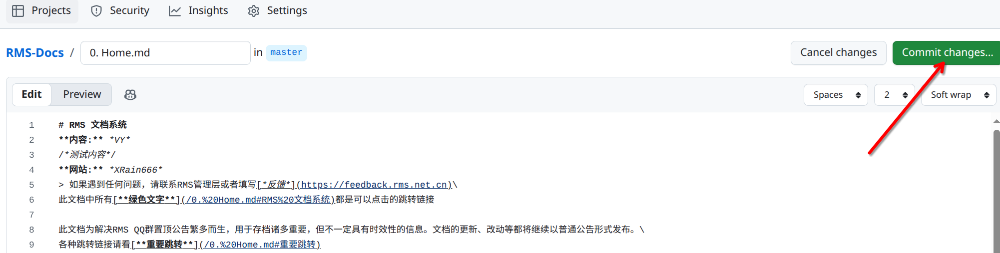
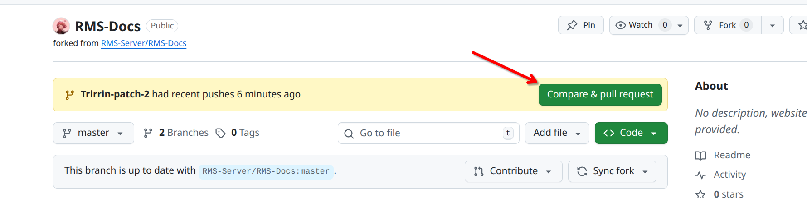
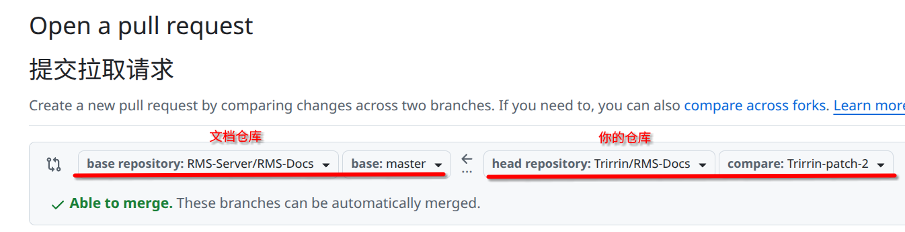
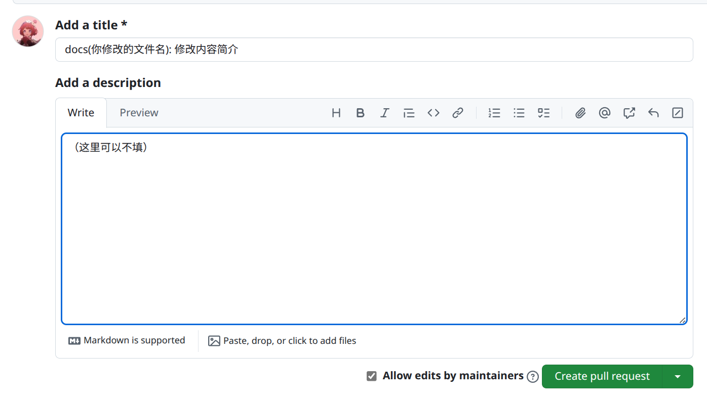
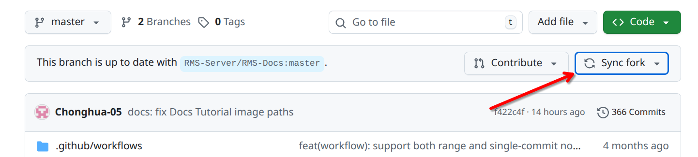

# Docs Tutorial: Submit PR

在 GitHub 网页上完成编辑后，就可以提交修改并发起 PR 了。本篇介绍完整的提交流程。

## 1. 提交流程概览

这一篇主要处理下面这段流程：

```text
编辑完成 -> 填写提交信息 -> 提交到分支 -> 发起 PR -> 等待审核 -> 合并
```

> [!NOTE]
> 在 GitHub 网页上编辑时，GitHub 会自动帮你创建分支，你只需要关注提交信息和 PR 内容即可。

---

## 2. 提交修改

编辑完成后，需要提交修改。

### 操作步骤

1. 在编辑页面右上角，找到 `Commit changes...` 按钮，点击它。



图 1：点击 Commit changes... 按钮打开提交区域。

2. 在弹出的区域中，第一个输入框填写提交说明（必填）。建议格式如下：

```text
docs: 更新安装说明
docs: 修正文档截图说明
docs: 补充提交流程
```

3. 在下方更大的文本框中可以填写更详细的说明（可选）。

4. 确认 `Create a new branch for this commit` 选项被选中（这是默认选项）。

5. 点击 `Propose changes` 按钮。

### 说明

- 提交说明要简洁明了，说明这次改了什么。
- 文档类修改建议以 `docs:` 开头。
- 分支名可以保持默认，GitHub 会自动生成。

---

## 3. 创建 Pull Request

> [!IMPORTANT]
> 提交后不要在跳转的页面直接创建 PR！那个页面的 PR 目标会是你的 Fork，而不是原仓库。请按下面的正确流程操作。

### 操作步骤

1. 提交后，页面会跳转。**不要点击任何按钮**，直接回到你 Fork 的仓库主页。

2. 在仓库主页上方，你会看到一条黄色提示条，类似：
   ```
   你的分支名 had recent pushes less than a minute ago
   ```



图 2：仓库主页上方会显示推送提示，右侧有 Compare & pull request 按钮。

3. 点击提示条右侧的 `Compare & pull request` 按钮。

4. 在打开的页面中，确认 PR 方向正确：
   - `base repository`: `RMS-Server/RMS-Docs`（原仓库）
   - `base`: `master`
   - `head repository`: `你的用户名/RMS-Docs`（你的 Fork）
   - `compare`: 你刚才创建的分支名



图 3：确认 PR 的方向正确——从你的 Fork 向原仓库提交。

5. 填写 PR 的标题和说明。



图 4：填写 PR 的标题和说明。

6. 点击 `Create pull request` 按钮提交 PR。

### PR 描述建议

```text
## 变更内容
- 更新了哪些文档
- 补充了哪些说明

## 影响范围
- 涉及哪些页面或章节

## 自查情况
- 已检查格式
- 已检查链接或图片引用
```

### 说明

- **关键点**：必须从仓库主页的提示条点击 `Compare & pull request`，这样 GitHub 才会自动识别目标为原仓库。
- PR 的方向是：你的 Fork → 原仓库。确认 `base repository` 是 `RMS-Server/RMS-Docs`。
- PR 标题要简洁，说明这次修改的主要内容。
- 创建成功后，可以在原仓库的 `Pull requests` 页面看到你的 PR。

---

## 4. 等待审核和合并

PR 创建后，等待维护者审核。

### 说明

- 审核者可能会提出修改意见，按意见修改即可。
- 如果需要修改，回到你自己的仓库，找到对应文件继续编辑，新的修改会自动添加到同一个 PR。
- PR 合并后，你会收到通知。

---

## 5. PR 合并后同步你的 Fork

PR 合并后，你的 Fork 可能会落后于原仓库。建议同步一下，方便下次修改。

### 操作步骤

1. 打开你自己的仓库页面：`https://github.com/你的用户名/RMS-Docs`
2. 如果有提示 `This branch is X commits behind RMS-Server:master`，点击 `Sync fork` 按钮。



图 4：点击 Sync fork 按钮同步你的 Fork。

3. 点击 `Update branch` 确认同步。
4. 等待同步完成。

### 说明

- 同步后，你的 Fork 就和原仓库保持一致了。
- 这样下次修改时，就是基于最新版本进行修改。

---

## 6. 后续贡献流程

完成第一次贡献后，后续的流程就简单多了：

```text
1. 打开自己 Fork 的仓库
2. 找到文件并编辑
3. 填写提交信息并提交
4. 创建 PR
5. 等待审核和合并
6. 合并后同步 Fork
```

---

## 7. 常见问题

### 1. 提交时看到 "Commit directly to the master branch" 选项

不要选择这个选项。应该选择 `Create a new branch for this commit and start a pull request`，这样才能创建 PR。

### 2. PR 的方向搞反了怎么办

创建 PR 时，确保：
- `base repository` 是 `RMS-Server/RMS-Docs`（原仓库）
- `head repository` 是 `你的用户名/RMS-Docs`（你的 Fork）

如果搞反了，关闭这个 PR，重新创建。

### 3. 需要修改已经提交的 PR 怎么办

回到你自己的仓库，找到对应文件继续编辑。新的修改会自动添加到同一个 PR，不需要重新创建。

### 4. Fork 需要删除重新创建吗

不需要。Fork 会一直存在，只需要定期同步即可。

### 5. 如何查看自己的 PR 状态

访问原仓库的 Pull requests 页面：`https://github.com/RMS-Server/RMS-Docs/pulls`

在页面中搜索你的用户名，或者筛选 `Author` 为你自己。

---

上一篇：[2. Edit Docs.md](/Docs%20Tutorial/2.%20Edit%20Docs.md)
