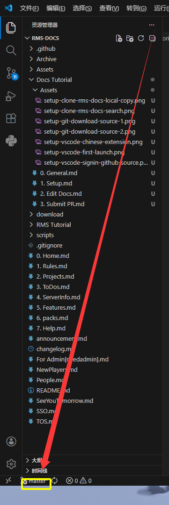
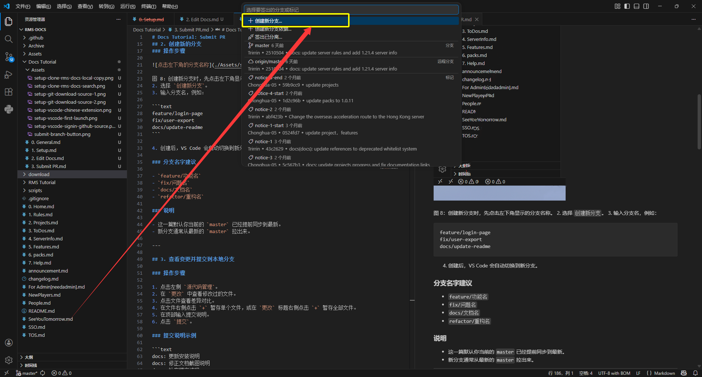
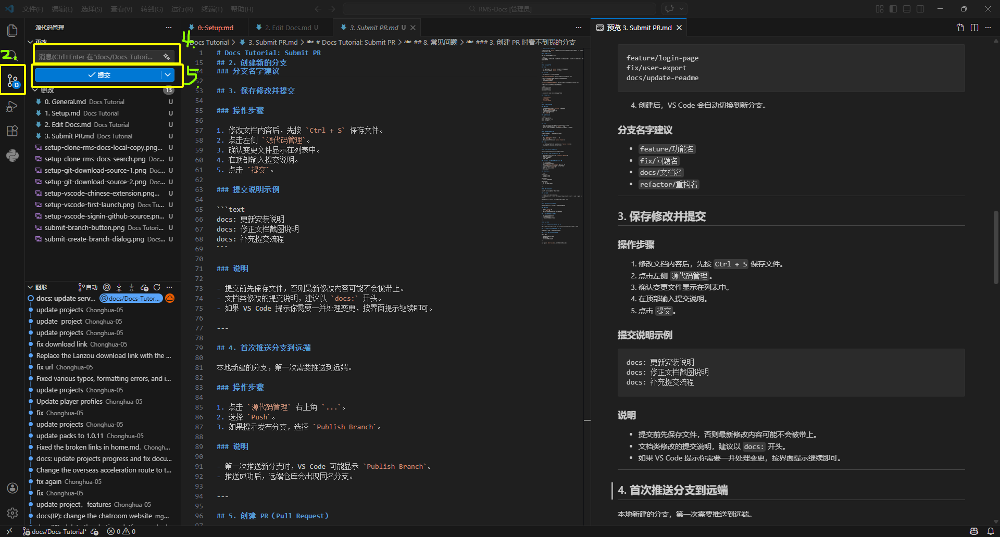

# Docs Tutorial: Submit PR

在你已经确认本地 `master` 是最新的，并且已经完成文档修改之后，就可以开始开分支、提交修改并发起 PR 了。

## 1. 提交流程概览

这一篇主要处理下面这段流程：

```text
创建新分支 -> 修改后保存 -> 提交修改 -> 推送到远端 -> 创建 PR -> 等待审核 -> 合并后清理本地分支
```

---

## 2. 创建新的分支

### 说明

- 这一篇默认你当前的 `master` 已经提前同步到最新。
- 新分支通常从最新的 `master` 拉出来。

### 操作步骤

1. 点击左下角当前显示的分支名称。



图 8：创建新分支时，先点击左下角显示的分支名称。
2. 选择 `创建新分支`。
3. 输入分支名，例如：



图 9：选择“创建新分支”后，输入分支名。

```text
feature/login-page
fix/user-export
docs/update-readme
```

4. 创建后，VS Code 会自动切换到新分支。

### 分支名字建议

- `feature/功能名`
- `fix/问题名`
- `docs/文档名`
- `refactor/重构名`

---

## 3. 保存修改并提交

### 操作步骤

1. 修改文档内容后，先按 `Ctrl + S` 保存文件。
2. 点击左侧 `源代码管理`。
3. 确认变更文件显示在列表中。
4. 在顶部输入提交说明。
5. 点击 `提交`。



图 10：图中标出了第 2、4、5 步，对应“点击源代码管理”“输入提交说明”“点击提交”。

### 提交说明示例

```text
docs: 更新安装说明
docs: 修正文档截图说明
docs: 补充提交流程
```

### 说明

- 提交前先保存文件，否则最新修改内容可能不会被带上。
- 文档类修改的提交说明，建议以 `docs:` 开头。
- 如果 VS Code 提示你需要一并处理变更，按界面提示继续即可。

---

## 4. 把分支上传到远端

当你刚创建好一个新分支，并且已经提交过修改后，还需要把这个分支上传到远端仓库。只有上传成功后，后面才能发起 PR。

### 操作步骤

1. 先确认你已经完成了上一步“保存修改并提交”。
2. 点击左侧 `源代码管理`。
3. 观察界面中是否出现 `Publish Branch`、`发布分支` 或类似按钮。
4. 如果看到了这个按钮，直接点击它。
5. 如果没有看到这个按钮，再点击右上角 `...`。
6. 在菜单中选择 `Push`。
7. 等待上传完成。

### 你可以这样理解

- `Publish Branch` 的意思就是“把这个新分支第一次上传到远端”。
- 对于新建分支，很多时候 VS Code 会优先显示 `Publish Branch`。
- 如果没有看到 `Publish Branch`，再去菜单里找 `Push` 即可。

### 说明

- 第一次上传新分支时，界面显示 `Publish Branch` 是正常的。
- 上传成功后，远端仓库里就会出现同名分支。
- 只有这一步完成后，后面才能继续创建 PR。

---

## 5. 创建 PR（Pull Request）

PR 通常在代码托管平台上创建，例如 GitHub。

### 常见方式一：VS Code 提示创建 PR

1. 推送分支后，点击提示中的 `Create Pull Request`。
2. 填写标题和说明。
3. 选择目标分支。
4. 提交 PR。

### 常见方式二：在代码平台网页中创建 PR

1. 打开仓库网页。
2. 找到刚刚推送的分支。
3. 点击 `Compare & pull request` 或类似按钮。
4. 选择源分支为你刚创建并提交过修改的分支。
5. 选择目标分支为 `master`。
6. 填写 PR 标题和说明。
7. 点击创建。

### PR 描述建议

```text
## 变更内容
- 更新了哪些文档
- 补充了哪些说明

## 影响范围
- 涉及哪些页面或章节

## 自查情况
- 已检查格式
- 已检查链接或图片引用
```

---

## 6. PR 审核与修改

创建 PR 后，通常需要经过代码审核。

### 常见情况

1. 审核通过：PR 可以直接合并。
2. 审核要求修改：继续在同一个分支上修改代码，然后重复“修改 -> 保存 -> 提交 -> Push”。

新的提交会自动进入已有 PR，不需要重新创建新的 PR。

---

## 7. PR 合并后同步本地代码

PR 合并完成后，建议把本地基线分支更新到最新。

### 操作步骤

1. 切换回 `master`。
2. 执行 `Pull`。
3. 如果不再需要旧分支，可删除本地分支。

### 删除本地分支的图形化操作

1. 点击左下角分支名称。
2. 选择分支管理。
3. 删除已合并的功能分支。

---

## 8. 常见问题

### 1. 为什么不能直接在 master 上开发

因为多人协作时，直接在主分支开发风险较高，容易影响他人，也不方便审核。

### 2. 审核意见修改后需要重新开 PR 吗

不需要。在原分支继续提交并推送即可。

### 3. 创建 PR 时看不到我的分支

可能原因：

- 分支还没有推送到远端。
- 推送失败。
- 当前仓库页面未刷新。

---

上一篇：[2. Edit Docs.md](./2.%20Edit%20Docs.md)


